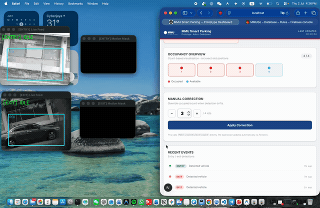

# MMU Smart Parking System 🚗

**Real-time parking occupancy monitoring — from camera to dashboard in under a second.**

An end-to-end IoT system that watches parking zones through ESP32-CAM units, detects vehicle entries/exits with an OpenCV pipeline, and streams live occupancy to a web dashboard. Built as my Final Year Project at Multimedia University.

> 🎯 ~80% vehicle detection accuracy under varying lighting conditions · dual entry/exit camera feeds · 4-slot live prototype · sub-second edge-to-dashboard latency

## Live demo



*Real footage (2× speed): entry/exit ESP32-CAM feeds with ROI detection and motion masks (left), live dashboard updating occupancy and event log (right). Full-quality video: [docs/realtime-detection.mp4](docs/realtime-detection.mp4)*

## How it works

```
ESP32-CAM  →  Python CV Engine  →  NestJS Backend  →  Firebase  →  Next.js Dashboard
 (MJPEG        (motion detection     (REST API +        (realtime      (live occupancy
  stream)       + contour analysis)   event tracking)    store)          map + analytics)
```

1. **ESP32-CAM units** stream MJPEG video over Wi-Fi — one covering the entry lane, one covering the exit lane of a 4-slot zone.
2. The **CV engine** (Python/OpenCV) preprocesses frames and detects vehicle entry/exit events using motion detection and contour analysis, with configurable per-camera roles (`cv-engine/detector.py`, `config.py`).
3. Events hit the **NestJS backend**, which owns occupancy state, exposes a REST API, and broadcasts updates.
4. **Firebase Realtime Database** syncs state to clients with sub-second latency.
5. The **Next.js dashboard** shows a live occupancy grid, zone map, event history, and manual-correction controls for operators.

## Features

- Live occupancy grid and zone map, updating in real time
- Vehicle entry/exit event log with history endpoint
- Manual correction UI (operators can fix miscounts — the system assumes CV is imperfect)
- Configurable camera roles and detection parameters without code changes
- Admin reset and stats endpoints

## Tech stack

| Layer | Tech |
|-------|------|
| Edge | ESP32-CAM (Arduino), MJPEG streaming |
| Detection | Python, OpenCV — preprocessing, motion detection, contour analysis |
| Backend | NestJS, TypeScript, REST, event tracking |
| Data | Firebase Realtime Database |
| Frontend | Next.js (App Router), React, TypeScript |

## API

| Endpoint | Method | Description |
|----------|--------|-------------|
| `/events/entry` | POST | Record vehicle entry |
| `/events/exit` | POST | Record vehicle exit |
| `/events/stats` | GET | Current occupancy |
| `/events/history` | GET | Recent events |
| `/admin/reset` | POST | Reset count to 0 |

## Quick start

### 1. Backend (NestJS)
```bash
cd backend
npm install
npm run start:dev        # http://localhost:5000
```

### 2. Frontend (Next.js)
```bash
cd frontend
npm install
npm run dev              # http://localhost:3000/dashboard
```

### 3. CV Engine (Python)
```bash
cd cv-engine
python -m venv venv
source venv/bin/activate   # Windows: .\venv\Scripts\activate
pip install -r requirements.txt
python main.py
```

### Configuration
- ESP32-CAM stream: set `CAMERA_SOURCE = "http://YOUR_ESP32_IP:81/stream"` in `cv-engine/config.py`
- Firebase: place `firebase-service-account.json` in `backend/`, and Firebase keys in `frontend/.env.local`

## Engineering decisions & lessons

- **Polling over listeners:** migrated the frontend from direct Firestore listeners to backend API polling to centralize state ownership and normalize timestamp serialization (see commit history).
- **Modular CV engine:** detection was refactored into configurable roles and motion-detection components so new cameras/zones are config, not code.
- **Human-in-the-loop:** ~80% detection accuracy means ~1 in 5 events needs correction — so the dashboard treats operator overrides as a first-class feature, not an afterthought.

## Roadmap

- [ ] Replace contour analysis with a lightweight object-detection model (YOLO-family) to push accuracy past 90%
- [ ] Per-slot detection (currently zone-level counting)
- [ ] Automated tests for the events API

---

**Lim Huan Yee** · Software Engineering, Multimedia University · [huanyee123@gmail.com](mailto:huanyee123@gmail.com) · [LinkedIn](https://linkedin.com/in/huanyee)
